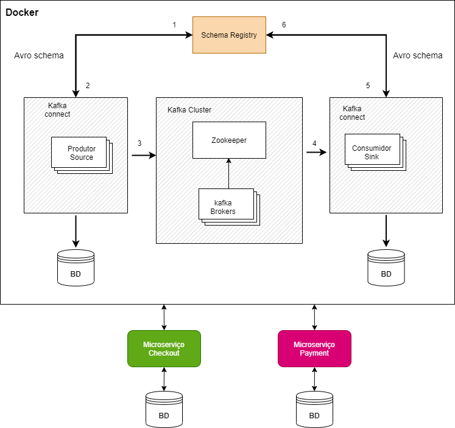

# ecommerce-checkout-api-udinei
Projeto prático de uma solução de e-commerce com
arquitetura de microserviços EDA (Arquitetura orientada a eventos),
com a criação de duas aplicações (microserviço) integradas com Apache Kafka,
e compatibilidade de comunicação utilizando Apache Avro e Schema Registry.

Event-driven Architecture (EDA) 

# Statck
- Java 15
- Spring Boot 2.4.4
- Spring Cloud Streams
- Gradle 6.8
- PostGresql 11
- Docker v19.03.8
- Docker-compose
- Zookeeper
- kafka
- schema-registry
- Jpa
- Apache Avro

Nota: Para detalhes, como versão e dependências
da stack ver arquivo build.gradle do projeto.
# Microserviço relacionado
* [Checkout](https://github.com/Udinei/ecommerce-checkout-api)

# FrontEnd
* [Cart](https://github.com/Udinei/ecommerce-checkout-frontend)

# Estrutura do projeto
- build (gerado pelo apache avro)
- src
    - main
        - java
            - config
            - entity
            - listener
            - repository
            - resource.checkout
            - service
            - streaming
            - util
    - test
        - java

## Atualizando repositorio local Maven
<pre>mvn help:evaluate -Dexpression=settings.localRepository
</pre>
## Compilando o projeto no terminal
<pre>gradle build</pre>

## Executando projeto no terminal

<pre>gradlew booRun</pre>

# Referências
* [Live Coding Daniel Hatanaka](https://github.com/hatanakadaniel)
* [Event-driven Architecture (EDA) usando microserviços ](https://medium.com/@marcelomg21/event-driven-architecture-eda-em-uma-arquitetura-de-micro-servi%C3%A7os-1981614cdd45#)
* [Apache Kafka](https://www.confluent.io/what-is-apache-kafka)
* [Google Cloud](https://cloud.google.com/solutions/capturing-change-logs-with-debezium?hl=pt-br)
* [Blog Emmanuel Neri](https://emmanuelneri.com.br/2019/06/04/kafka-no-spring-boot/)
* [Blog Atitude Reflexiva](https://atitudereflexiva.wordpress.com/2020/03/05/apache-kafka-introducao/)
